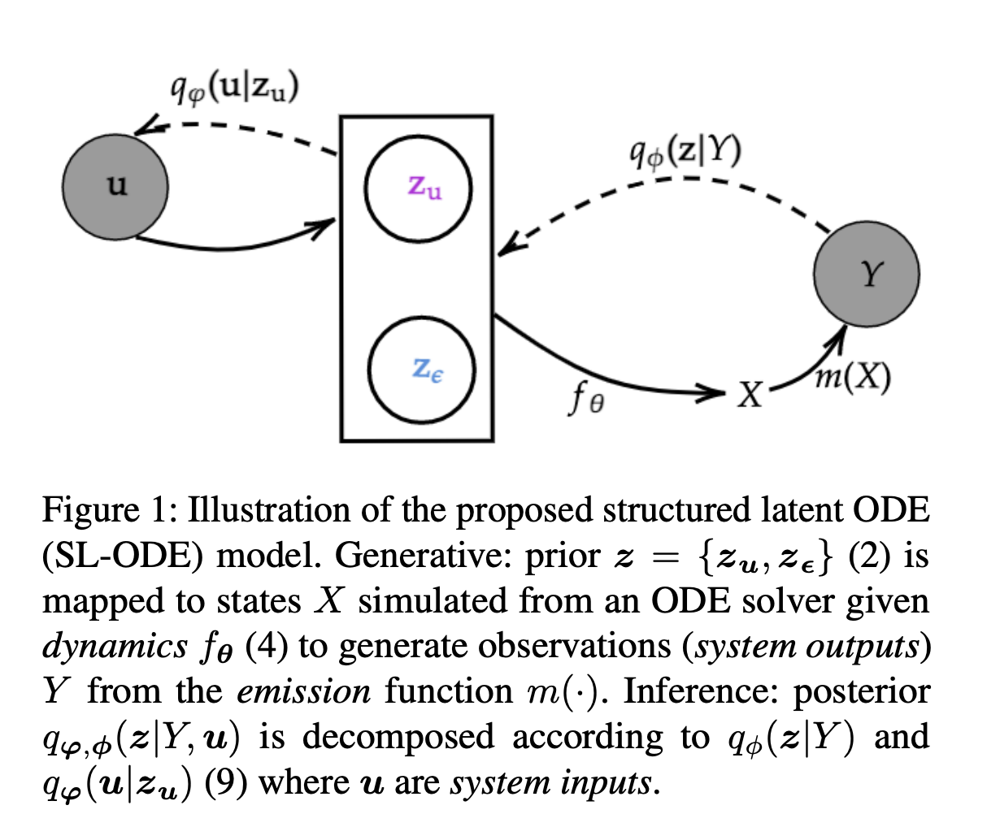

# Capturing Actionable Dynamics with Structured Latent Ordinary Differential Equations (UAI 2022)

This repository contains the Pytorch code to replicate experiments in our paper [Capturing Actionable Dynamics with Structured Latent Ordinary Differential Equations](https://openreview.net/forum?id=Sbxu8Ujqg9) accepted at Conference on Uncertainty in Artificial Intelligence (UAI 2022):

```latex
@inproceedings{chapfuwa2022capturing,
  title={Capturing Actionable Dynamics with Structured Latent Ordinary Differential Equations},
  author={Chapfuwa, Paidamoyo and Rose, Sherri and Carin, Lawrence and Meeds, Edward and Henao, Ricardo},
  booktitle={The 38th Conference on Uncertainty in Artificial Intelligence},
  year={2022}
}
```

## Model


## Prerequisites

The code is implemented with the following dependencies:

- [Python  3.8.10](https://github.com/pyenv/pyenv)
- [Torch 2.3.0](https://pytorch.org/)
- Additional python packages can be installed by running: 

```
pip install -r requirements.txt
```

## Data
We consider the following datasets:
<!-- - [Human Viral Challenge]() -->
- [Cardiovascular System (CVS)](cvs.ipynb) 
<!-- - [Synthetic Biology]() -->

## Model Training

* To train the data specific **SLODE** models run:
  - [training_cvs.py](training_cvs.py) 

* The data specific hyper-parameters settings can be found at:
  - [config_cvs.py](data/cvs/config_cvs.py) 

## Metrics and Visualizations

* Once the networks are trained and the results are saved, we visualize the data specific key results:
  - [cvs_eval_final.ipynb](cvs_eval_final.ipynb)
